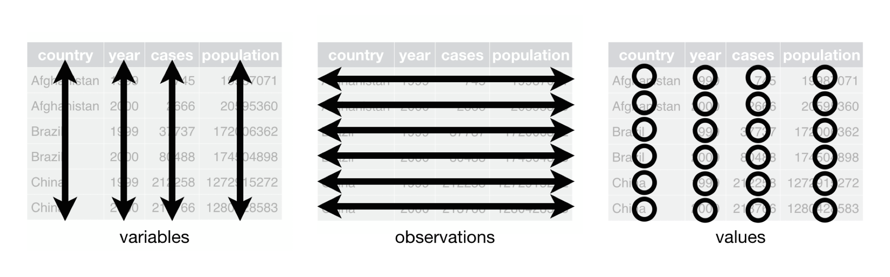
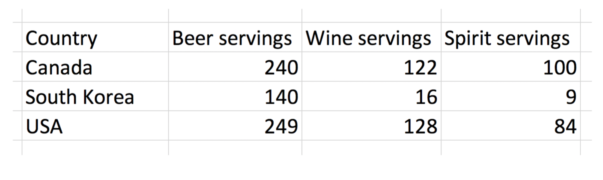
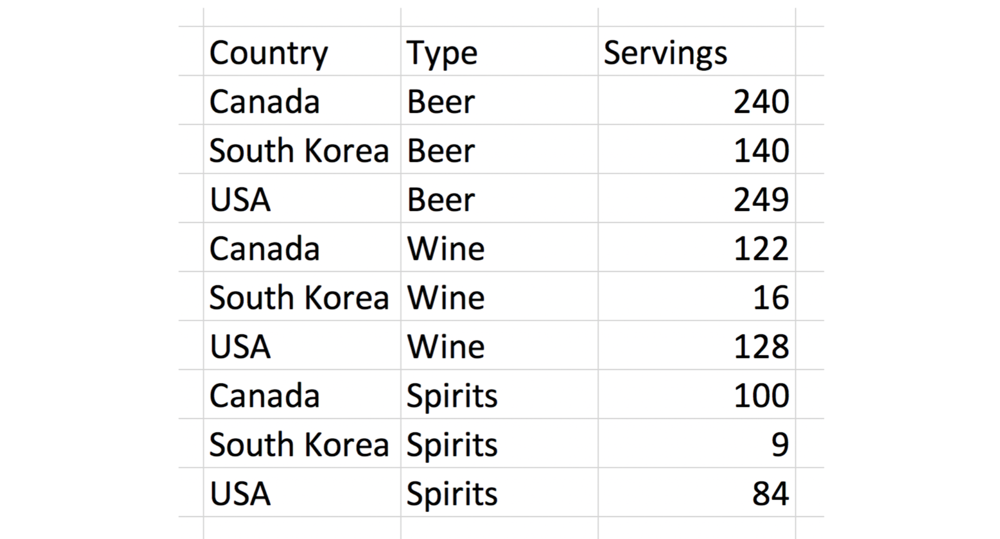
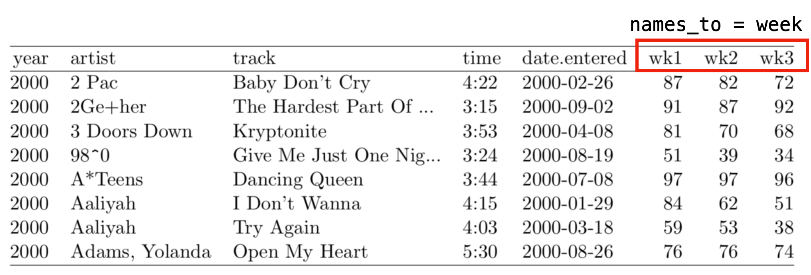
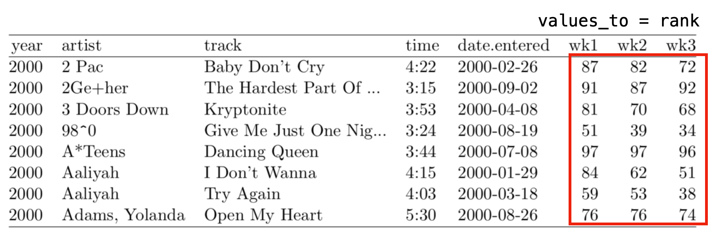
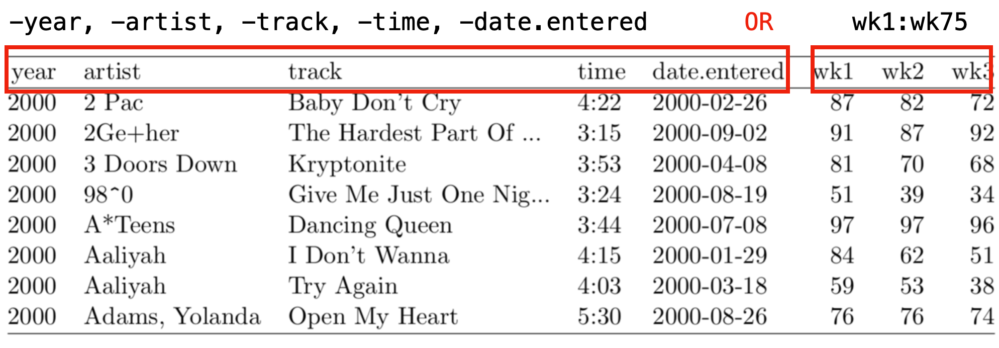

```{css}
.highlight-red { background-color: #ffcccc !important; }
.highlight-blue { background-color: #cce5ff !important; }
.highlight-yellow { background-color: #fff3cd !important; }
.highlight-green { background-color: #d4edda !important; }
```


## What is tidy data?

```{r include=FALSE}
library(tidyverse)
library(kableExtra)
library(janitor)
```

Clean perfect data?

## What is a dataset?

> A **dataset** is a collection of values, usually either numbers (if quantitative) or strings AKA text data (if qualitative/categorical). **Values** are organized in two ways. Every value belongs to a **variable** and an **observation**. A **variable** contains all **values** that measure the same underlying attribute (like height, temperature, duration) across units. An **observation** contains all **values** measured on the same unit (like a person, or a day, or a city) across attributes.

## What is "tidy" data?

> "Tidy" data is a standard way of mapping the meaning of a dataset to its structure. A dataset is messy or tidy depending on how rows, columns and tables are matched up with observations, variables and types.

## What is "tidy" data?



::: notes
1.  Each variable forms a column
2.  Each observation forms a row
3.  Each type of observational unit forms a table
:::

## Untidy: Column headers are values



## Tidy



# Wide vs. Long Data

## Case study: Billboard ranking data

```{r echo=FALSE}
billboard
```

## How do we tidy data?

-   We use the `pivot_longer` function from the `tidyr` package

-   Three arguments:

    1.  names_to,
    2.  values_to,
    3.  the column(s) we do or do not want to tidy

    ::: aside
    Additional arguments may be necessary in some cases
    :::

## `names_to`

-   the name of the column/variable in the new "tidy" frame containing the column names of the original data frame we want to tidy

## `names_to`



## `values_to`

-   the name of the column/variable in the "tidy" frame containing the rows and columns of values in the original data frame we want to tidy

## `values_to`



## Columns we do, or do not, want to tidy

-   want ( c(var1, var2, var3))
-   or do not want (-var1, -var2)

## Columns we do, or do not, want to tidy



## Tidy Billboard Rankings

```{r echo=TRUE}
billboard_tidy <- billboard %>% 
  pivot_longer(
    names_to = "week", 
    values_to = "rank", 
    wk1:wk76,
    values_drop_na = TRUE
  )
billboard_tidy
```

# Case Study: Idaho ISAT Data

## The Raw Data

```{r echo=TRUE}
library(tidyverse)
library(kableExtra)
library(janitor)

isat_2024 <- read_csv("data/Districts_2024-ISAT-Results.csv") %>% 
  clean_names()

glimpse(isat_2024)
```

## Another look at the data

```{r}
isat_2024 %>% 
  select(1:5,7,9, 11) %>%  
  head(15) %>%      
  kable() %>%
  kable_styling(
    bootstrap_options = c("striped", "hover"),
    font_size = 18,
    position = "center"
  ) %>%
  scroll_box(width = "100%", height = "600px")
```

## Step 1: Clean up some weird values in the data

```{r, echo=TRUE}
isat_2024 <- isat_2024 %>% 
  mutate(
    across(c(advanced_rate, proficient_rate, basic_rate, below_basic_rate),
    ~ ifelse(.x == "***", NA, .x)))
```

## Step 2: Come up with a plan

::: {.r-stack}

::: {.fragment .current-visible fragment-index=1}

```{r}
isat_2024 %>% 
  select(1:5,7,9, 11) %>%  
  head(15) %>%      
  kable() %>%
  kable_styling(
    bootstrap_options = c("striped", "hover"),
    font_size = 18,
    position = "center"
  ) %>%
  scroll_box(width = "100%", height = "600px")
```

:::

::: {.fragment .current-visible fragment-index=2}

```{r}
isat_2024 %>% 
  select(1:5,7,9, 11) %>%  
  head(15) %>%      
  kable() %>%
  kable_styling(
    bootstrap_options = c("striped", "hover"),
    font_size = 18,
    position = "center"
  ) %>%
  row_spec(0, background = "#fff3cd", bold = TRUE) %>% 
  scroll_box(width = "100%", height = "600px")
```

:::

::: {.fragment .current-visible fragment-index=3}

```{r}
isat_2024 %>% 
  select(1:5,7,9, 11) %>%  
  head(15) %>%      
  kable() %>%
  kable_styling(
    bootstrap_options = c("striped", "hover"),
    font_size = 18,
    position = "center"
  ) %>%
  row_spec(0, background = "#fff3cd", bold = TRUE) %>%
  column_spec( c(6, 7, 8), background = "#ffcccc") %>% 
  scroll_box(width = "100%", height = "600px")
```

:::

::: {.fragment .current-visible fragment-index=4}

```{r}
isat_2024 %>% 
  select(1:5,7,9, 11) %>%  
  head(15) %>%      
  kable() %>%
  kable_styling(
    bootstrap_options = c("striped", "hover"),
    font_size = 18,
    position = "center"
  ) %>%
  row_spec(0, background = "#fff3cd", bold = TRUE) %>%
  column_spec( c(6, 7, 8), background = "#ffcccc") %>% 
  column_spec( c(3, 4, 5), background = "#cce5ff") %>%
  scroll_box(width = "100%", height = "600px")
```

:::
:::

## The Plan 

- `pivot_longer()` to make the data tidy
- Review the tidy dataset and see what we need for our analysis


## Step 3: Implement the Plan

```{r, echo=TRUE}
isat_2024_longer <- isat_2024 %>% 
   pivot_longer(
    cols = c(advanced_rate, proficient_rate, basic_rate, below_basic_rate, tested_rate),
    names_to = "metric",
    values_to = "value"
  )
```


## Review pivot_longer results
::: {.r-stack}

::: {.fragment .current-visible fragment-index=1}
```{r}
isat_2024_longer %>% 
    select(1:5,12,13) %>%  
  head(15) %>%      
  kable() %>%
  kable_styling(
    bootstrap_options = c("striped", "hover"),
    font_size = 18,
    position = "center"
  )
```
:::

::: {.fragment .current-visible fragment-index=2}
```{r}
isat_2024_longer %>% 
    select(1:5,12,13) %>%  
  head(15) %>%      
  kable() %>%
  kable_styling(
    bootstrap_options = c("striped", "hover"),
    font_size = 18,
    position = "center"
  ) %>% 
column_spec( c(6,7), background = "#ffcccc")
```

:::

::: {.fragment .current-visible fragment-index=3}
```{r}
isat_2024_longer %>% 
    select(1:5,12,13) %>%  
  head(15) %>%      
  kable() %>%
  kable_styling(
    bootstrap_options = c("striped", "hover"),
    font_size = 18,
    position = "center"
  ) %>% 
column_spec( c(6,7), background = "#ffcccc") %>% 
column_spec( 2, background = "#d4edda") 
```

:::
:::

## The Plan 

- <span class="fragment strike" data-fragment-index="1">`pivot_longer()` to make the data tidy</span>
- <span class="fragment strike" data-fragment-index="2">Review the tidy dataset and see what we need for our analysis</span>
- <span class="fragment" data-fragment-index="3">untidy the data... for analysis</span>

## Pivoting wider
```{r, echo=TRUE}
isat_2024_wider <- isat_2024_longer %>% 
  pivot_wider(
    id_cols = c(district_id, district_name),
    names_from = c(subject_name, grade, population, metric),
    names_sep = "_",
    values_from = value)
```

## Ready for analysis
```{r}
isat_2024_wider %>% 
  head(15) %>%      
  kable() %>%
  kable_styling(
    bootstrap_options = c("striped", "hover"),
    font_size = 18,
    position = "center"
  ) 
```
